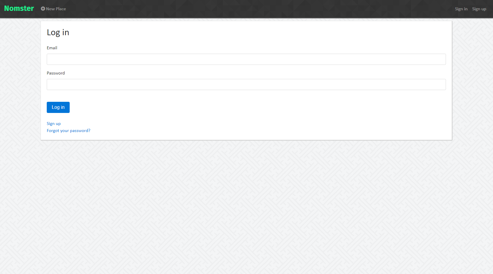
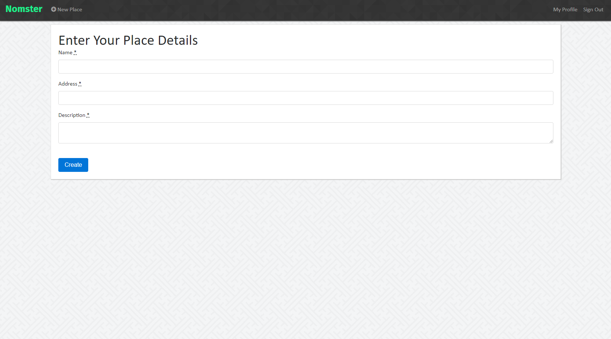
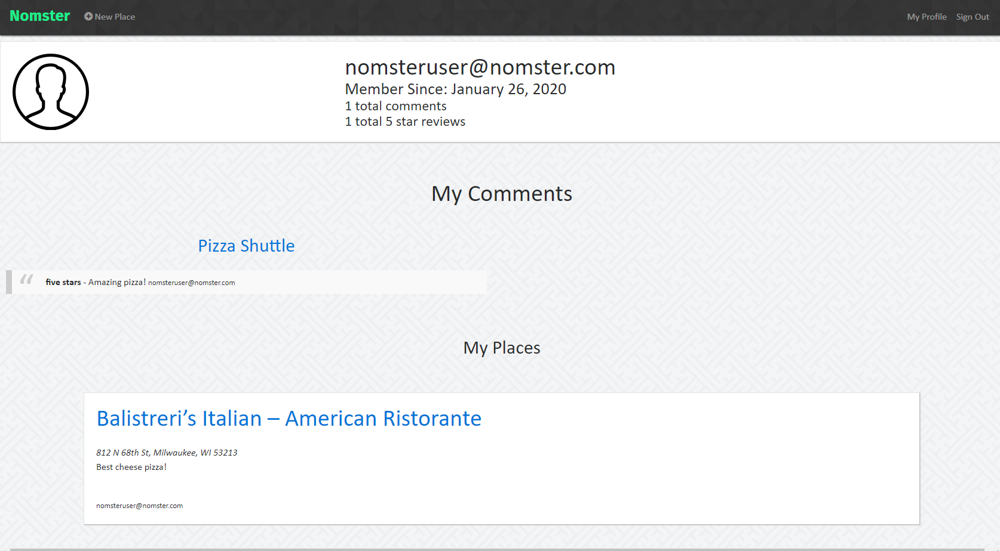

# OVERVIEW

* User-friendly restaurant review app that integrates with the Google Maps API and includes features like user comments, star ratings, image uploading, and user authentication.
*  View the app here: <a href="https://nomster-nick-parsley.herokuapp.com/">Nomster</a>

# LANDING PAGE

* Landing page will show the list of places that have been added by users.
* Each listed place will include the name, address, and description of the place added by the user.
* The most recent (if any) comment will be shown under the place.

# PLACES

* Each name of a place listed on the landing page is a link that will direct the user to a new page showing the location, photos, comments, and description of place.
* If the address provided is accurate, then a google map will be displayed with the location pinned.

# USERS

* Users will sign in to add places including name, description, photos, and address (as shown on google map).  

* Users can comment, give ratings, and add photos for places added by other users.

* Users can view their entire history of comments and places created by clicking on the My Profile link.
* When a new comment or rating is made to a place, the user that initially added the place will receive an e-mail notification with an update.

